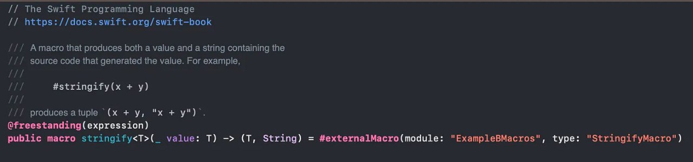

# Swift 5.9 TL;DR
As a mobile architect and developer for the [4Industry](https://4industry.io) iOS app, my daily work revolves around reading and writing a lot of Swift.
This year I want to improve my expertise, particularly by diving deeper into the evolving landscape of Swift.
Instead of learning about language changes due to compiler errors from updating XCode to a new major version and the associated Swift language level, I want to stay ahead learn about the features so I can start using them.

Xcode 15.2 with Swift 5.9 just released so I decided to write a TL;DR[^1] on the main new features.
For a complete list read the official blog article [here]([https://www.swift.org/blog/swift-5.9-released/](https://www.swift.org/blog/swift-5.9-released/ "https://www.swift.org/blog/swift-5.9-released/").

# Language Improvements
- Bi-directional compatibility with c++
- ⁠[Macros](https://medium.com/@ezgiustunel/swift-5-9-macros-5d2884f6ece7#:~:text=by%20Aaron%20Burden-,We%20met%20Macros%20with%20Swift%205.9.,cannot%20see%20in%20compile%20time. "https://medium.com/@ezgiustunel/swift-5-9-macros-5d2884f6ece7#:~:text=by%20Aaron%20Burden-,We%20met%20Macros%20with%20Swift%205.9.,cannot%20see%20in%20compile%20time.")

- ⁠[Parameter packs](https://www.avanderlee.com/swift/value-and-type-parameter-packs/ "https://www.avanderlee.com/swift/value-and-type-parameter-packs/")  
    Generic methods with arbitrary param count
- If and switch as expressions  
```swift
statusBar.text = if !hasConnection { "Disconnected" }
                 else if let error = lastError { errorlocalizedDescription }
                 else { "Ready" }
```
- Debugging improvements
[p and po](https://stackoverflow.com/questions/28806423/whats-the-difference-between-p-and-po-in-xcodes-lldb-debugger "https://stackoverflow.com/questions/28806423/whats-the-difference-between-p-and-po-in-xcodes-lldb-debugger") speed increase
- Swift package manager improvements
- Improvements to [Swift-syntax project](https://github.com/apple/swift-syntax)  
- Windows platform improvements


# Closing thoughts
I think I'm most excited to start using the if expressions, to make some code a bit more readable. And possibly in some cases replace var statements with let's. I hope the improvements to the syntax project will add new capabilities the Swift code analysis tools. Finally any debugger speed improvements are always appreciated, `po` in some of my usecases can feel sluggish at times.


# Footnotes
[^1]: [TL;DR](https://en.wikipedia.org/wiki/TL;DR) - Too long ; didn't read. In essence a summary.