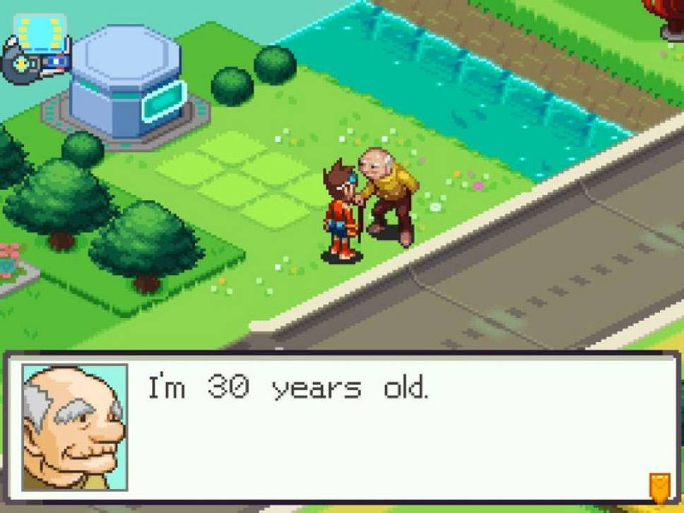

Starting this when I'm just about 28 to give myself enough time to procrastinate. Finally publishing this a month after turning 30.
None are particularily life changing, but theyve made my life better.

1. Create your own goofy family traditions.
2. Deep dive interesting topics, when you find an interesting rabbit hole dig in!
3. Don't be afraid of doing things or life will pass you by.
4. Drink sparkling water instead of soda.
5. Focus not on what happened and why it limits your options, but what actions you can take.
6. Express your creativity, the medium doesn't matter as long as you go out and create.
7. Reflect on yourself and write it down on paper with a pen.
	Using pen and paper forces you to slow down your thinking as your hand can't keep up, this will make you contemplate what you are writing down more.
8. Whole-ass the things you do.
9. Do your holiday gift shopping early.
10. Do *Weird* things unordinary things make for fun memories, good weird like going on an last minute trip instead of not going because its against the norm.
11. Find some form of exercise that you enjoy it can also be something with habit stacking, for me its going to the gym while listening to podcasts \[[unmade](https://unmade.fm), [Cortex](https://www.relay.fm/cortex)\].
12. In your career take jobs to **learn** or **earn** otherwise keep trying to grow towards those. Try not to stick around when things get stagnent but when you earn, you can spend energy on other avenues.
13. Be critical of ideas both your own and others, but stay open to them.
    *Strong opinions loosely held*
14. Consistently show up, frequency is experience, experience leads to quality.
15. Be in the moment by trying to enjoy whatever you're doing 10% more.
16. Sometimes its better to grow your strengths rather than trying to improve your weaknesses.
17. Ask yourself if what you are doing is the optimal thing, is it something you are enjoying? If not you've got better things to do and you know what they are.
18. Go to events related to your interests life is all about the experiences you make
19. Don't fear advanced tools as they can be very useful, but don't depend on them to do the work for you.
20. Make video records of things you have made, cool things you made at work or for your hobbies. In years when memories fade it can be fun to look back on.
21. You can create your own luck by working hard and being ready when opportunity strikes
22. Engaged creation gives purpose so find your thing, it can be anything as long as its you creating it and you enjoying the process of the creation.
23. Give yourself permission to create even if it's not the "right" way, if everyone only follows the same practices then innovation will stop.
24. If you have the space go where your interests take you, don't force yourself to keep working on a project you can always pause and come back to it. Working with motivation will get you results faster although you don't always have the luxury to choose.
25. Sleeping enough, getting some exercise, getting sun and socializing with friends. It's common advice but it really does wonders for your sanity.
26. To achieve your goals setup systems don't assume you will get there on vibes only. Without a system a bad day can break a pattern of progress.
27. When a choice feels so painful that you attempt to default to inaction, **DO NOT** allow yourself to not also feel the implication of the inaction, that can just leave you in a bad situation longer.
28. Take a step back and try to look at yourself from a third person perspective to try and see both the good and bad from an outside perspective.
29. Spread investments (if you have any) into multiple avenues to spread the risk. Also investing a little consistently monthly or quarterly will help you build up for the future.
30. Action creates motivation, don't wait and don't continuously stop you will lose the power of momentum.

---

---

# Sources

[32 ways to be better at life](https://www.youtube.com/watch?v=vobLTc8Zd1Q)

[68 bits of unsolicited advice from Kevin Kelly](https://www.youtube.com/watch?v=Zz70rcguxwk)
